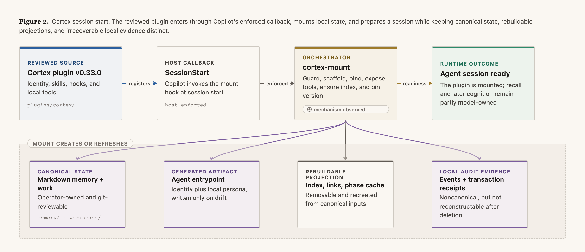

# Architecture of Cortex `v0.33.0`

This document describes the implementation reviewed for version `0.33.0`. It separates the behavior
provided by executable tools from cognition that remains model- or operator-owned.

## Scope

Cortex is a committed host plugin, not a service or an agent runtime. It supplies:

- resident cognition instructions;
- five procedural skills;
- a projection tool that combines those instructions with an agent persona;
- a Copilot CLI session-start adapter;
- local retrieval, event, phase, and transaction helpers.

It does not supply a model, scheduler, network service, remote memory store, or sandbox. The
consumer repository owns the agent persona, memory, work, and generated host entrypoint.

The plugin version is repeated in the two plugin manifests and the marketplace index.
[`scripts/cortex-lint`](../scripts/cortex-lint) checks that they agree.

## Cognition and enforcement

`WAKE`, `WORK`, `SLEEP`, and `CURATE` are semantic responsibilities, not universal host callbacks.


| Stage | Shipped behavior in the Copilot adapter | Enforcement boundary |
|---|---|---|
| `WAKE` | Session start mounts the plugin and creates an expectation | Mount is enforced; recall remains model-owned |
| `WORK` | Resident instructions require grounding and capture | Model-owned; Stop can only nudge capture |
| `SLEEP` | `consolidate` defines validation and promotion | Model-owned; no verified pre-compaction callback |
| `CURATE` | `curate` defines review and pruning | Operator-invoked; no periodic callback |

The authoritative matrix is
[`identity/capabilities.md`](../plugins/cortex/identity/capabilities.md). Its labels are:
`enforced`, `nudged`, `model-owned`, `operator-invoked`, and `unknown`. Unknown host behavior is
never silently upgraded to enforced.

## Components

| Path | Role |
|---|---|
| `.claude-plugin/marketplace.json` | Indexes the committed plugin |
| `plugins/cortex/identity/` | Cognition and authority contracts |
| `plugins/cortex/skills/` | Recall, consolidate, curate, encode, and filing procedures |
| `plugins/cortex/bin/` | Agent binding and session-start mounting |
| `plugins/cortex/tools/` | Local projections and validated state helpers |
| `plugins/cortex/hooks/` | Copilot lifecycle registration |
| `plugins/cortex/plugin.json` | Canonical plugin version and metadata |
| `scripts/` | Repository maintenance utilities |
| `tests/` | Deterministic regression tests |

The plugin is the distributed artifact. Documentation, repository utilities, and tests are not
installed into a consumer.

### Identity and skills

`identity/` is the resident instruction layer. Its most important public contracts are:

- [`capabilities.md`](../plugins/cortex/identity/capabilities.md): enforcement and authority;
- [`memory-schema.md`](../plugins/cortex/identity/memory-schema.md): canonical record shape;
- [`memory-visibility.md`](../plugins/cortex/identity/memory-visibility.md): state tiers;
- [`cognition-events.md`](../plugins/cortex/identity/cognition-events.md): local event privacy;
- [`cognition-phases.md`](../plugins/cortex/identity/cognition-phases.md): phase correlation;
- [`consolidation-transactions.md`](../plugins/cortex/identity/consolidation-transactions.md):
  validated memory writes.

`skills/` contains model-readable procedures. They describe how cognition should happen, but their
presence does not prove invocation or completion.

### `cortex-bind`

[`cortex-bind`](../plugins/cortex/bin/cortex-bind) combines three identity fragments with a local
persona:

| Host | Generated entrypoint |
|---|---|
| Copilot CLI | `.github/agents/<name>.agent.md`, plus an optional thin `AGENTS.md` pointer |
| Claude Code | `CLAUDE.md` |

Outputs are replaced only when their composed content changes. A Copilot consumer may also receive a
thin `AGENTS.md` pointer. Source identity and persona remain separate and git-reviewed.

### `cortex-mount`

[`cortex-mount`](../plugins/cortex/bin/cortex-mount) is registered as the Copilot `SessionStart`
hook. It is silent outside repositories containing `agents/*.md`.



The hook does not pull plugin updates or push consumer changes. Rebinding may be auto-committed only
when the consumer explicitly sets `CORTEX_REBIND_AUTOCOMMIT`; it never pushes.

Phase observation, rebinding, event emission, and version notes are designed to avoid blocking a
session when their advisory work fails. Retrieval-index failure produces a warning and leaves the
grep fallback available. Filesystem failures while creating required state may still fail the hook.

## State ownership

Cortex distinguishes canonical, git-reviewed state from local runtime projections:

| Class | Examples | Lifecycle |
|---|---|---|
| Canonical, git-reviewed | `agents/*.md`, `memory/*.md`, `workspace/**/*.md`, version pins | Edited through normal work or validated transactions |
| Generated but reviewable | Host entrypoints from identity plus persona | Replaced only when derived content changes |
| Rebuildable local projection | `memory/cortex-index.db`, tool links, phase state under `.cortex/` | Rebuilt or recreated from canonical state and the installed plugin |
| Local audit and recovery evidence | cognition events and transaction receipts under `.cortex/` | Appended locally; removable but not reconstructable after deletion |

The generated host entrypoint is derived but normally committed so changes remain visible. The
retrieval database, tool links, phase state, event log, and transaction receipts are gitignored.
Removing any of them must not remove canonical memory. Only the index, links, and phase cache are
rebuildable. Deleting events loses observability history; deleting transaction receipts can prevent
reconciliation or recovery of an interrupted write.

Runtime tools inherit the invoking process's filesystem permissions. They provide path validation
and narrow write contracts, not process isolation.

## Per-session flow

### 1. Mount

The host invokes `cortex-mount`. If no persona exists, the hook exits without changing the
repository.

### 2. Establish advisory phase context

When the phase helper and Python are available, the hook derives a private lane and owner from the
host session identifier. It reconciles stale phase state, creates or reuses a `WAKE` expectation, and
returns only an opaque receipt through additional context.

The receipt is an observability handle. It is not proof that `recall` ran.

### 3. Scaffold canonical state

Missing `memory/` and `workspace/` directories receive readable Markdown seeds. Existing files are
not replaced.

### 4. Refresh projections

Each persona is rebound into a Copilot entrypoint. An existing Claude projection is refreshed, but
the hook does not create one unprompted. Executable plugin tools are linked into `.cortex/bin/`.

### 5. Ensure retrieval readiness

`recall-index ensure` compares canonical semantic memory with the local projection. A missing or
stale BM25 index is rebuilt atomically. A current index is left untouched. `ensure`, `status`, and
ordinary search do not download a model.

If SQLite or the sidecar is unavailable, retrieval names the degradation and uses grep. Optional
dense fusion is a removable accelerator, never the only copy of memory.

### 6. Reconcile the version pin

The installed plugin version is compared with `.cortex-version`. On a change, the previous value is
written to `.cortex-version.previous`, the pin is updated, and the delta is printed to stderr.
Errors in this bookkeeping do not block startup.

## Retrieval and persistence

Canonical semantic memory is Markdown:

- `memory/learnings.md`
- `memory/decisions.md`

`recall-index` exposes stable record references such as:

```text
memory/learnings.md::search-before-building
```

Its public operations are `search` (with the `query` compatibility alias), `fetch`, `expand`,
`status`, `audit`, `ensure`, `rebuild`, and `eval`. `eval` requires an explicit golden-set path
outside the original development workspace. Search results and synthetic evaluations demonstrate
retrieval mechanics only. They do not demonstrate delivery to or use by a model.

Episodic work under `workspace/` is not part of the semantic retrieval index. Recall scans that
directory separately for active work and intake debt.

## Validated memory writes

The consolidation transaction helper is the only executable path permitted to write canonical
memory automatically. A plan names exact targets, pre-image hashes, operations, and candidate
provenance. Validation precedes apply; receipts and reconciliation expose complete, partial, failed,
and already-applied states.

Skill and identity changes remain ordinary source edits and require a git commit. The transaction
tool cannot rewrite them.

## Local observability and privacy

Cortex writes optional content-minimal events to `.cortex/cognition-events.jsonl`. The event
contract permits bounded enums, hashes, counts, durations, and stable references. It excludes
prompts, responses, record bodies, credentials, raw identities, and absolute paths.

Event emission is fail-open and can be disabled with `CORTEX_EVENTS=off`. An event proves only that
the emitting mechanism observed the named state. It does not prove model attention, causality, or
improved behavior. Event history is disposable but not rebuildable.

## Host and extension boundaries

The verified lifecycle adapter is Copilot CLI:

- `SessionStart` runs `cortex-mount`;
- `postToolUse` observes successful skill-tool results;
- `Stop` runs a capture and drain check.

Claude Code support is limited to generating `CLAUDE.md` from the same identity and persona. No
equivalent callback matrix was verified. Other hosts require their own adapter and must document
their enforcement levels independently.

The stable extension seams are:

- add a host projection to `cortex-bind`;
- add a host-specific lifecycle adapter without changing semantic phase meanings;
- replace the retrieval projection while keeping Markdown canonical;
- add procedural skills that honor the same authority and state contracts.

## Known limits

- Mechanism traces do not show that memory reached or influenced the model.
- `SLEEP` and `CURATE` are not automatically enforced by the verified host adapter.
- The design assumes a trusted local operator and consumer repository.
- Markdown and local SQLite suit a personal or small-agent setting, not concurrent multi-writer
  operation.
- The current mount script does not safely handle consumer paths or persona filenames containing
  spaces.
- The retrieval evaluator's historical default golden-set path is not shipped; callers must pass
  an explicit file.
- Optional dense-retrieval packages and model artifacts are not pinned or maintained.

The shortest statement of the project's conclusions is in
[`findings.md`](findings.md).
