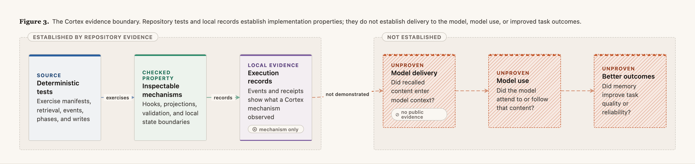

# Findings and limitations

This page records the evidence boundary for active Cortex development. Unless a later dated
section says otherwise, implementation conclusions below apply to the reviewed `v0.33.0` plugin
baseline. It distinguishes properties exercised by checked-in tests from broader claims the
project has not established.



## Supported conclusions

| Conclusion | Repository evidence | Boundary |
|---|---|---|
| Agent state can remain plain Markdown while local tools use faster projections. | Memory contracts, `recall-index`, index audit and regression tests | Shows state separation and retrieval mechanics, not model use |
| Identity and persona can be composed deterministically into host entrypoints. | `cortex-bind` and the local-install regression test | Verified Copilot projection, not equivalent behavior across hosts |
| A session-start adapter can make setup, projection refresh, state scaffolding, and retrieval readiness observable. | Local-install, cognition event, phase, and retrieval tests | Shows that mechanisms ran, not that recall completed |
| Canonical memory writes can be pre-image checked, receipted, and reconciled. | Consolidation transaction contract and tests | Protects write integrity; semantic judgment remains model- or operator-owned |
| Local operational traces can avoid storing prompts and memory bodies. | Cognition event schema, path checks, redaction tests | Applies to Cortex events, not to host or model-provider telemetry |

These conclusions concern implementation properties. They are reproducible without a model by
running:

```bash
scripts/cortex-lint
for test in tests/test-*; do "$test"; done
```

## Pi-harness evaluation (2026-08-27)

An evaluation-only Pi controller enforced `WAKE -> WORK -> SLEEP` around adapted
MemoryAgentBench acquisition and delayed-use tasks. Regular, advisory, and Pi-enforced Cortex
received the same immutable source evidence and deterministic BM25 retrieval. The frozen
instrumentation pilot sampled 20 questions from each of five streams, used three repetitions, and
retained every planned question in the denominator.

| Condition | Correct | Accuracy | Execution errors | Recorded cost |
|---|---:|---:|---:|---:|
| Regular evidence use | 254/300 | 84.7% | 0 | `$2.0328` |
| Pi-enforced Cortex | 246/300 | 82.0% | 0 | `$4.0669` |
| Voluntary advisory guidance | 235/300 | 78.3% | 2 | `$3.6149` |

Cortex trailed regular by 2.7 percentage points; the clustered 95% interval was -6.3 to +0.3
points. It led advisory by 3.7 points, with an interval of -0.7 to +8.7 points. The frozen
positive-result rule was not met.

The controller completed all 300 Cortex evaluations without a lifecycle or citation error and
prevented unconfirmed answer-time memory writes. Cortex nevertheless used 1.95 times regular's
tokens and 2.00 times its recorded cost without improving aggregate accuracy. Its deficit was
concentrated in the two multi-hop streams.

This is a bounded negative result, not standard MemoryAgentBench leaderboard evidence. The pilot
used 20 of 100 questions per stream and is not confirmatory. It does not establish enforcement by
the current host adapters, beneficial `CURATE`, superior retrieval, coding-task improvement,
production reliability, or cross-model generalization. Within those boundaries, the result shows
that the Pi controller enforced the procedure, but the evaluated formation-and-use treatment did
not establish better delayed-task outcomes than both controls.

## Not established

The reviewed `v0.33.0` baseline does not provide public evidence that:

- recalled records consistently entered the model's context;
- an LLM attended to or followed those records;
- `WAKE`, `WORK`, `SLEEP`, and `CURATE` all ran automatically;
- accumulated memory improved general task quality;
- optional dense retrieval improved downstream behavior;
- the design remains reliable under concurrent writers or a large fleet of agents;
- Claude Code or another host enforced the same lifecycle as Copilot CLI.

The distinction matters because an index hit, hook event, or loaded skill is only mechanism
evidence. None is a behavioral outcome by itself.

## Practical conclusion

Cortex is best read as a design and implementation study in operator-owned agent cognition. Its
strongest contribution is not a claim of autonomous self-improvement. It is the explicit separation
between:

- canonical state and removable projections;
- semantic phases and host callbacks;
- mechanism evidence and behavioral evidence;
- automatic writes and operator approval.

Those boundaries remain useful reference points. Proving the behavioral loop would require a
separate controlled research program rather than inference from the plugin's mechanisms.
